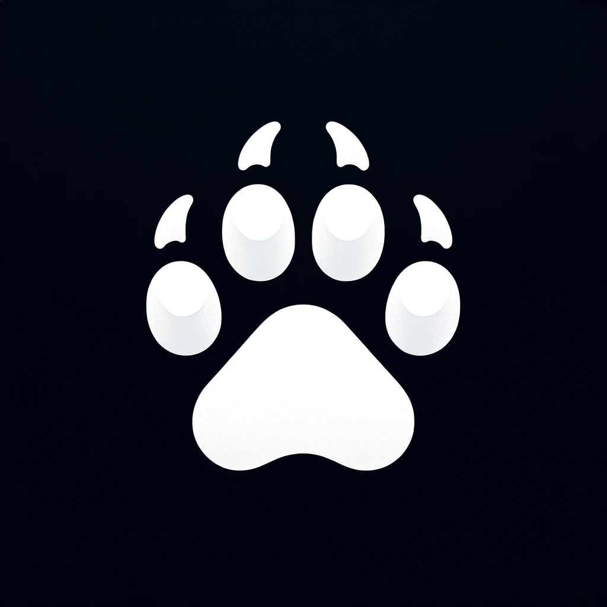
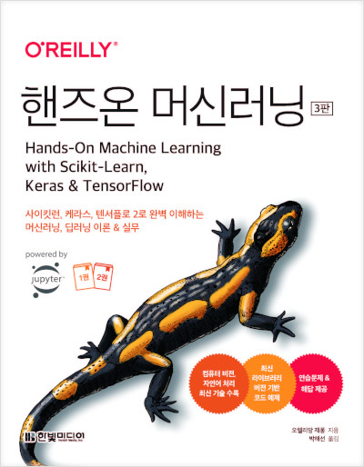

#  **Hands-On-Machine-Learning Study Repository** 
### Kaggom Study group에서 진행하는 `Hands-on-machine-learing` 책을 읽고 정리하며 생각을 나누는 스터디입니다. 책 스터디 이외에도 캐글 대회 참여와 같은 competition 활동들을 진행합니다. 
### 스터디기간 : `🔥2023년 12월 18일 ~ 2024년 3월 4일🔥` 

    

## 🐻 🐻‍❄️ 🧸 Kaggom Study Member 🧸 🐻‍❄️ 🐻 


<table>
  <tr>
    <td align="center"><a href="https://github.com/Pjunn"><br/><b>🐟박준서🐟</b></a><br /><a href="https://github.com/Pjunn" title="Code"></td>
    <td align="center"><a href="https://github.com/7lpear"><br /><b>🐯손기배🐯</b></a><br /><a href="https://github.com/7lpear" title="Code"></td>
    <td align="center"><a href="https://github.com/suhyeonx"><br /><b>🧋이수현🧋</b></a><br /><a href="https://github.com/suhyeonx" title="Code"></td>
    <td align="center"><a href="https://github.com/lee-youn"><br /><b>🥔이윤정🥔</b></a><br /><a href="https://github.com/lee-youn" title="Code"></td>
    <td align="center"><a href="https://github.com/Jeon-jisu"><br/><b>🚀전지수🚀</b></a><br /><a href="https://github.com/Jeon-jisu" title="Code"></td>
    <td align="center"><a href="https://github.com/bambini77"><br /><b>🪶최윤창🪶</b></a><br /><a href="https://github.com/bambini77" title="Code"></td>
  </tr>
</table>

## 📁 Project Structure 📁

프로젝트 구조를 참고해 과제물을 제출해주세요!
<br>

```
│
├─ 2023-2-Hands-On-Machine-Learning-Study
│     │
│     ├─ Pjunn (dir)
│     │     │ 
│     │     ├─  Week_1 (dir) // 해당 주차 내용 정리 및 소스코드
│     │     │    ├─ week1.md // 해당 주차 책 내용 정리. 파일명은 확장자는 `.md` 
│     │     │    ├─ answer1.md // 해당 주차 과제 답변 정리.
│     │     │    └─ `기타 소스 코드 및 자료들`
│     │     │
│     │     ├─  Week_2 (dir) // 해당 주차 내용 정리 및 소스코드
│     │     │    ├─ week2.md
│     │     │    ├─ answer2.md // 해당 주차 과제 답변 정리.
│     │     │    └─ `기타 소스 코드 및 자료들`
│     │     │
│     │     └─ .. 이하 동일
│     │   
│     ├─ .. 이하 동일
│     │
│     └─ Assignment Questions (dir)
│           │ 
│           ├─  question_Week1.md // 해당 주차 과제 질문.
│           └─ .. 이하 동일
│
│
```
<br>


## 👮🏻 캐곰스터디 규칙 👮🏻

* `📒 book 진도표`에 맞는 챕터를 풀고 **각자 이름**으로 된 폴더 밑에 정리본을 업로드해 주세요.
* 화요일 밤에 제공되는 구글폼을 통해 질문에 답해요. **책과 관련이 없는 내용이더라도 궁금증이 들면** 언제든지 자유롭게 디스코드의 질문과 답변 채널에서 답을 찾아가요

* `💡 문제 목록` 에는 각 챕터에 맞게 제작된 생각해봐야할 문제들이 존재합니다.
* `🔥 디스코드 캠공 채널` 에서 주중 오후 9시~11시 카메라를 키고 공부를 합니다. (* 개인별 참여  가능 일정표를 매주 월요일에 작성합니다.)
* `👧🏻 대면 스터디` 매주 일요일 오후 4시 30분 ~ 6시 30분에 학교  스터디룸에서 스터디가 진행됩니다. 

## 📝 과제 제출 가이드 📝

1. clone 혹은 remote 명령어 등을 이용해 리모트 리포지토리와 연결합니다.
2. 최초 작업시 `[자신의 github 아이디]`와 동일한 이름의 branch를 만들고> 본인 branch로 checkout으로 이동하여 본인의 브랜치명과 동일한 이름의 디렉토리를 만듭니다. (위 프로젝트 구조 참고)
3. `[자신의 github 아이디]`와 동일한 이름의 branch로 switch하여 작업하고 push 합니다.
4. 과제 제출 기한에 맞춰 main branch로 PR을 날립니다.
5. PR은 `[본인 이름] N주차 제출합니다.`의 제목으로 작성해주시면 됩니다.
   <br>

   ### ⏰ 과제 제출 마감 기한 ⏰
   매주 일요일 스터디가 진행된 후 답안을 고치고 각주차 공부 내용을 정리하여 월요일에 PR을 보내주시면 됩니다.

------


